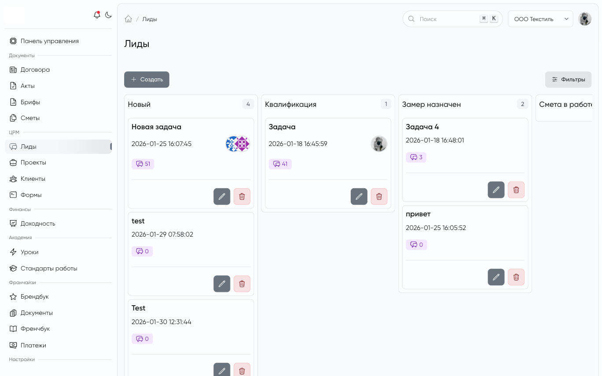

# MoonShine Kanban Builder

`dissnik/moonshine-kanban-builder` is a snapshot-driven MoonShine kanban component.

This package now has a single public integration path:

- the host application owns column/item snapshots;
- the package renders those snapshots and manages drag-and-drop runtime;
- refresh, reorder persistence, and card-open behavior stay consumer-owned.

Legacy server-rendered builder columns, field mappers, and classic `CardsBuilder`-style usage were removed.

<picture>
    
</picture>

## Installation

```bash
composer require dissnik/moonshine-kanban-builder
php artisan vendor:publish --tag=moonshine-kanban-builder-assets
```

Optional config publishing:

```bash
php artisan vendor:publish --tag=moonshine-kanban-builder-config
```

## Usage

```php
use DissNik\MoonShineKanBanBuilder\Components\KanBanBuilder;

KanBanBuilder::make()
    ->name('lead-list')
    ->reorderUrl($this->getResource()->getAsyncMethodUrl('reorder'))
    ->snapshot($this->buildSnapshotPayload(...))
    ->snapshotUrl($this->getSnapshotUrl())
    ->refreshEvents('lead-kanban:refresh')
    ->cardClickEvent('lead-kanban:card-open');
```

The consumer remains responsible for:

- generating the snapshot payload;
- exposing the snapshot endpoint;
- persisting drag reorder;
- deciding which browser events should force a refresh;
- handling card-open behavior in the host application.

## Snapshot Contract

`snapshot()` and `snapshotUrl()` must use the same payload shape.

Minimal example:

```json
{
  "changed": true,
  "version": "hash",
  "columns": [
    {
      "id": "new",
      "label": "New",
      "items": [
        {
          "id": "lead-1",
          "html": "<div>...</div>",
          "title": "Lead",
          "form_url": "/resource/1",
          "open_url": "/resource#lead-1"
        }
      ]
    }
  ]
}
```

Rules:

- `columns[].id` is the stable column identity used by the JS runtime and reorder protocol.
- `items[].id` is the stable card identity used for DOM diffing and reorder persistence.
- `items[].html` is consumer-rendered card markup injected into the board as-is.
- extra item keys are preserved and passed back to `cardClickEvent()` as `event.detail.card`.
- `changed: false` may be returned with an empty `columns` array when nothing changed.

The package exposes value objects for this contract:

- `DissNik\MoonShineKanBanBuilder\Support\KanbanSnapshot`
- `DissNik\MoonShineKanBanBuilder\Support\KanbanColumn`
- `DissNik\MoonShineKanBanBuilder\Support\KanbanItem`

## Reorder Protocol

Drag reorder is persisted through a strict JSON payload:

```json
{
  "item_id": "lead-1",
  "column_id": "qualification",
  "previous_column_id": "new",
  "ordered_ids": ["lead-1", "lead-2"]
}
```

Client-side field names are also exposed through `KanbanReorderPayload::clientConfig()`.

On the server side, parse the same JSON shape through the package value object:

```php
use DissNik\MoonShineKanBanBuilder\Support\KanbanReorderPayload;

$payload = KanbanReorderPayload::fromArray($request->all());

$payload->itemId;
$payload->targetColumnId;
$payload->previousColumnId;
$payload->orderedIds;
```

`KanbanReorderPayload::fromArray()` throws `InvalidArgumentException` when any required field is missing or `ordered_ids` is not a non-empty list of card ids.

## Transport And Config

Package defaults live in `config/moonshine-kanban-builder.php`:

```php
return [
    'events' => [
        'reorder_refresh' => [
            'fragment_updated:crud-list',
        ],
    ],
    'transport' => [
        'mode' => 'manual',
        'polling' => [
            'interval' => 5000,
        ],
        'signals' => [
            'refresh' => 'kanban.refresh',
        ],
        'allowed_modes' => [
            'manual',
            'polling',
            'websocket',
        ],
        'adapter' => null,
    ],
    'ui' => [
        'reorder_refresh_cooldown_ms' => 600,
    ],
];
```

### Transport Modes

- `manual`: the board refreshes only from browser events.
- `polling`: the board also refreshes on the configured polling interval.
- `websocket`: reserved transport boundary; add a host adapter when realtime delivery is introduced.

### Structured Transport Boundary

The package resolves transport through:

- `DissNik\MoonShineKanBanBuilder\Contracts\KanbanTransportContract`
- `DissNik\MoonShineKanBanBuilder\Support\KanbanTransport`
- `DissNik\MoonShineKanBanBuilder\Support\NullKanbanTransport`

Per-board overrides are available:

```php
KanBanBuilder::make()
    ->transportMode('polling')
    ->pollInterval(7000);
```

## Breaking Changes

This refactor intentionally removed the old package API:

- `groups()` was removed.
- `reorderRoute()` was replaced by `reorderUrl()`.
- `initialSnapshot()` was replaced by `snapshot()`.
- legacy server-rendered card columns and field-mapper API were removed.
- snapshot columns now use `id` instead of `status`.
- snapshot items now use `html` instead of `card_html`.
- reorder now sends JSON `ordered_ids` instead of CSV `data`, and `column_id` instead of `parent`.

## Asset Publishing

After rebuilding package assets, republish them to the consumer application:

```bash
npm run build
php artisan vendor:publish --tag=moonshine-kanban-builder-assets --force
```

If the app still uses old browser behavior after package changes, stale published assets are the first thing to check.

## Testing

Package tests:

```bash
vendor/bin/phpunit -c phpunit.xml.dist
```

Consumer validation:

```bash
cd franchise && php artisan test tests/Unit/KanbanPackageContractTest.php
cd franchise && composer check
```
